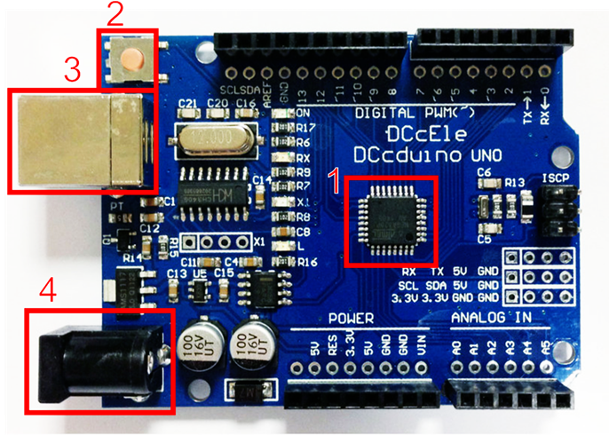

# Плата Ardion UNO та її особливості
__Мета:__ Ознайомитися з характеристиками та роботою мікроконтролера Arduino Uno.

Arduino – апаратна обчислювальна платформа, основними компонентами якої є плата вводу/виводу та середовище розробки на мові Processing/Wiring.

Arduino застосовується для створення електронних пристроїв з можливістю отримання сигналів від різних керуючих елементів (сенсори, кнопки тощо) і управління різними виконавчими пристроями (лампочки, двигуни тощо). 

Оригінальні плати Arduino виробляються фірмою SmartProjects. На даний момент доступно 20 версій плат, які різняться характеристиками мікроконтролера та кількістю аналогових і цифрових виводів. 

Найпопулярнішою версією Arduino є Arduino Uno ([рис. 1](#fig-arduino-board)), який побудований на основі мікроконтролера ATmega328P фірми Atmel (1 на [рис. 1](#fig-arduino-board)). 

<figure markdown="block" id="fig-arduino-board">

{ width="300" }

<figcaption>Плата Arduino Uno: 1 – мікроконтролер; 2 – кнопка скидання; 3 – порт USB; 4 – живлення 5В
</figcaption>

</figure>

??? info "Основні характеристики плата Arduino Uno"

    

    
 Характеристики Arduino Uno 

    | Параметр | Значення |
    | ------ | :-----: |
    | Робоча напруга | 5 В |
    | Вхідна напруга (рекомендована) | 7-12 В  |
    | Вхідна напруга (гранична) | 20 В
    | Кількість цифрових входів/виходів | 14 (6 з них можуть бути в ролі ШІМ)  |
    | Кількість аналогових входів/виходів | 6  |
    | Постійний струм через вхід/вихід | 40 мА  |
    | Постійний струм для виходу 3.3V | 50 мА |
    | Флеш-пам’ять (0,5 Кб використовуються для завантажувача) | 32 Кб (ATmega328P) |
    | ОЗП | 2 Кб (ATmega328P) |
    | Тактова частота | 16 МГц |

    

Згідно з наведеними параметрами, напруга зовнішнього джерела живлення може бути в межах від 6 до 20 В, однак, __рекомендується використовувати джерело живлення з напругою в діапазоні від 7 до 12 В__, адже нижче 7 В напруга на виводі 5V знизиться і це може стати причиною нестабільної роботи пристрою, більше 12 В може викликати перегрів стабілізатора напруги вихід плати з ладу. 

## Контакти живлення (`POWER`):
VIN
: Напруга, що надходить в Arduino безпосередньо від зовнішнього джерела живлення (не пов'язане з 5В від USB або іншим стабілізованою напругою). Через цей вивід можна як подавати зовнішнє живлення, так і споживати струм, коли пристрій живиться від зовнішнього адаптера.

5V
: На цей роз'єм надходить напруга 5В від стабілізатора напруги, незалежно від того, як живиться пристрій: від адаптера (7 - 12В), від USB (5В) або через вивід VIN (7 - 12В).

3.3V
: 3.3В, що надходять від стабілізатора напруги. Максимальний струм, споживаний від цього виводу, становить 50 мА.

GND
: Вивід землі – загальний контакт.

!!! danger
    Живити пристрій через виводи 5V або 3V3 не рекомендується, оскільки в цьому випадку не використовується стабілізатор напруги, що може привести до виходу плати з ладу.

## Цифрові та аналогові входи і виходи

На відміну від людей, комп'ютери працюють та спілкуються за допомогою двох символів: «1» та «0». Це те, що називається цифровими сигналами. Використовуючи комбінації цих двох символів, цифрові машини можуть представляти практично все у Всесвіті

D2 ... D13
: Цифрові входи/виходи дають можливість приймати або подавати низьку чи високу напругу. Низька напруга (`LOW` або `0`)  означає що на цьому піні напруга становить близько 0 вольт. Висока напруга (`HIGH`, `1`) означає що на піні близько 5 вольт.

A0 ... A5
: Аналогові входи можуть приймати значення напруги не тільки `0` або `1`. Вони дають змогу зчитувати і проміжні значення від 0 до 5 вольт присвоївши значення напрузі від `0` до `1023` поділок. 

??? info "Переведення поділок в напругу"

    Тобто якщо з порту отримуємо значення `1023` то це означає, що на вході напруга 5 В, тоді за пропорцією завжди можна визначити напругу $V_A$, знаючи значення на вході `AX`:
    $$
    V_A = \frac{5}{1023} \cdot AX  \tag{1.1}
    $$

ШІМ контакти
: На контакти позначені  `~` (для Arduino Uno це `D3`, `D5`, `D6`, `D9`, `D10`, `D11`) можуть подаватися значення від `0` до `255`. 

??? info "Широтно-імпульсна модуляці"
: це процес керування шириною (тривалістю) імпульсів.

*[ШІМ]:широтно-імпульсна модуляці
