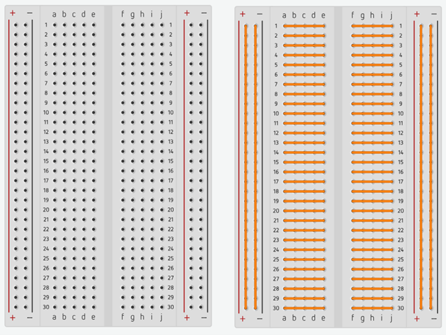
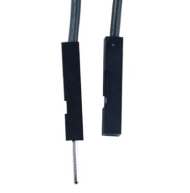

# Макетна плата (Breadboard)
__Мета:__ Ознайомитися з принципом роботи макетної плати та навчитися використовувати її для складання електронних схем без пайки.

## Макетна плата (breadboard)

Макетна плата — це пристрій для швидкого складання та тестування електронних схем без пайки.

Вона дозволяє **багаторазово** змінювати з’єднання компонентів під час розробки та навчання.

На рис. 2 показано малу плата та схему внутрішніх з’єднань на ній.

<figure markdown="block" id="fig-arduino-board">

{ width="500" }

<figcaption>Макетна плата на 30 рядів (Breadbord): вигляд згори (зліва) та з’єднання пінів (справа)
</figcaption>
</figure>

Кожен ряд контактів всередині макетної плати електрично з’єднаний.

Це означає, що елементи, вставлені в один ряд, утворюють один електричний вузол.

Макетка плата розділена на так окремі зони: 2 зони живлення (справа та зліва) та основна зона по центру. Контакти в правій і лівій частинах основної зони не з'єднані між собою, тому ми й маємо по 30 контактів в кожній зоні та 2 пари $(+\nobreakspace і \nobreakspace-)$ шин живлення, тобто:

$$
30\cdot 2 + 2\cdot 2 = 64 \space контакти
$$

Прийнято під'єднувати `GND` мікроконтроллера до `-` breadboard, а `5V`/`3.3V` - до `+`

<!-- 
"Додати приклад електрична схема - її реалізація на макетній платі
-->

## З’єднувальні дроти

Разом з breadbord використовують дроти для з’єднання, які мають спеціальні контакти (рис. 3).

<figure markdown="block" id="fig-arduino-board">

{ width="200" }

<figcaption>Контакти дротів, які використовуються при роботі з breadbord: тип контакту, зображений зліва називається «тато», справа «мама»
</figcaption>
</figure>

Використовуючи різні комбінації контактів маємо три типи дротів:

«тато-тато»
: використовується для з'єднання Ardino UNO з Breadboard

«тато-мама»
: використовується для з'єднання Ardino UNO або Breadboard з модулями і датчиками

«мама-мама»
: використовується для з'єднання модулів між собою, або для підключення до інших мікроконтроллерів, наприклад Arduino Nano або STM32

## Висновок
Макетна плата є основним інструментом для прототипування електронних схем і дозволяє швидко тестувати ідеї без пошкодження компонентів.

!!! warning "Типові помилки"
    - Підключення компонентів у різні електричні групи.
    - Переплутані шини живлення (`+` і `−`).
    - Відсутність спільної землі (GND). Важливо пам'ятати, що права і ліви шини живлення не з'єднані між собою
    - Використання довгих проводів без потреби.

!!! info "Як думати про breadboard"
    Кожен ряд контактів = один електричний вузол  
    Якщо два елементи в одному ряду → вони електрично з’єднані  